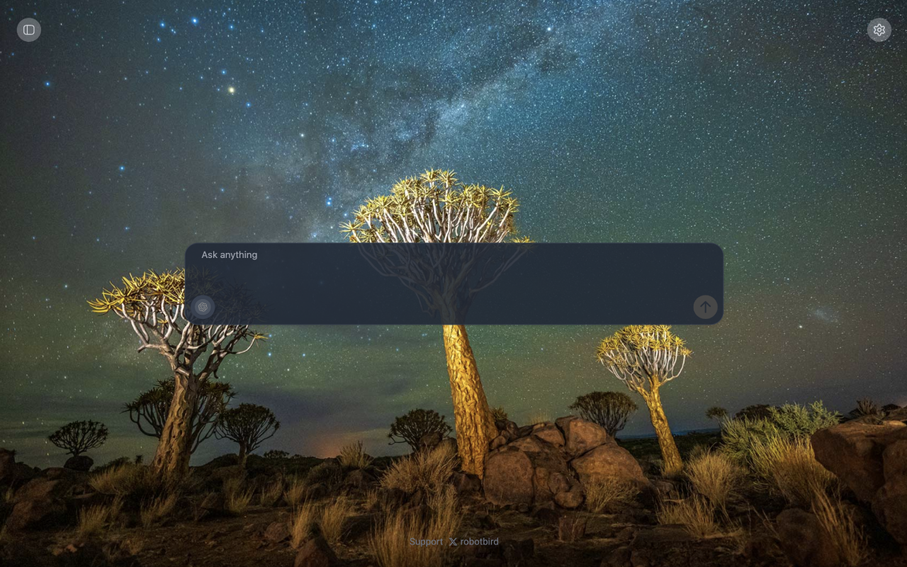
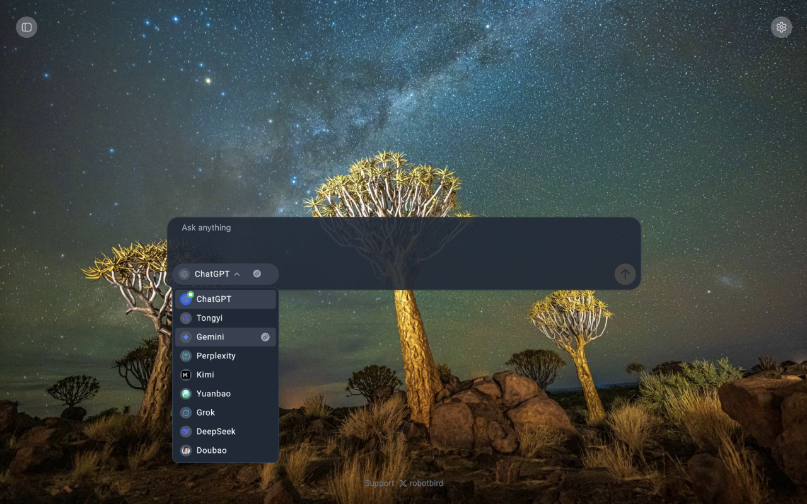
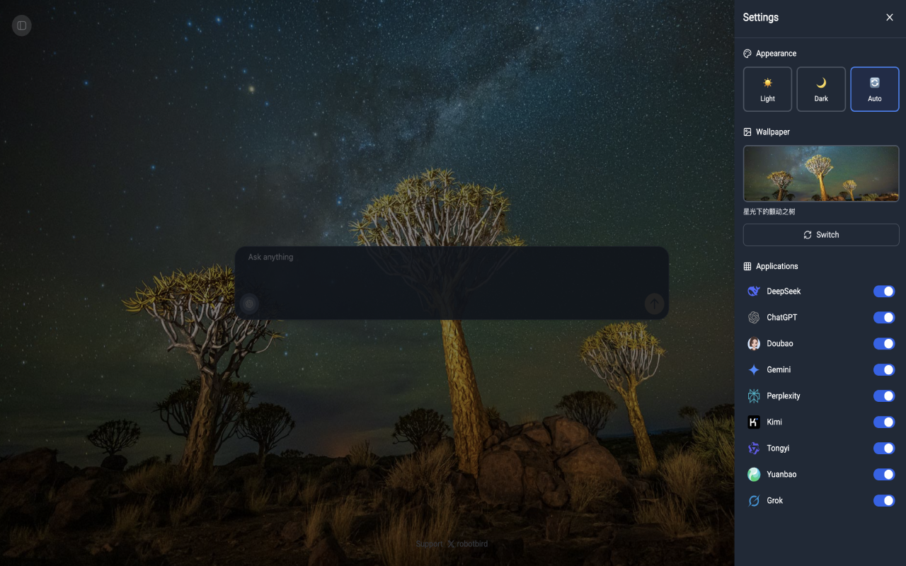
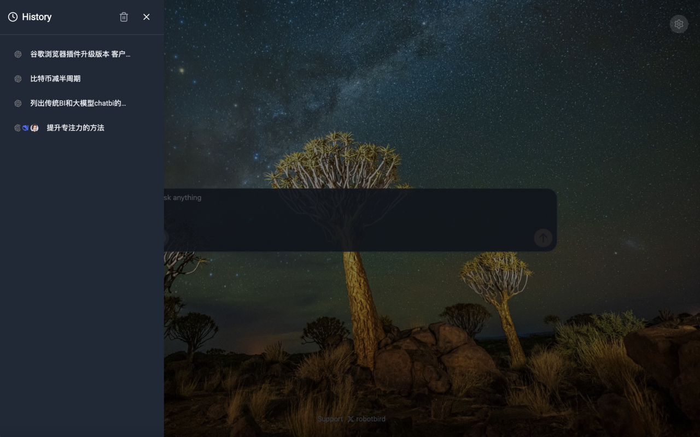

# ChatAB - New Tab Extension

<div align="center">

A browser extension that replaces your new tab page with a customizable chat interface supporting multiple AI models.

[](https://github.com/robotbird/chatab)
[](LICENSE)
[](https://chrome.google.com/webstore)
[](https://x.com/PMAndDog)

</div>

---

## 📖 Introduction

ChatAB is a powerful browser extension that transforms your new tab page into an intelligent chat hub. It allows you to quickly batch submit prompts to multiple AI applications simultaneously, enabling efficient comparison of responses across different AI models.

**主要功能：**
- 🚀 一键批量提交 Prompt 到多个 AI 平台
- 🎨 智能随机背景切换
- ⚙️ 自定义常用 AI 平台
- 🌍 多语言支持（English, 中文简体, 中文繁体, 日本語）
- 📝 历史记录管理

## ✨ Features

### Core Features

- **Batch Prompt Submission** - Quickly send prompts to multiple AI applications (ChatGPT, DeepSeek, etc.) with a single click, enabling efficient comparison of different model responses.

- **Smart Background Switching** - Randomly change Chrome startup page backgrounds for a fresh experience every time you open your browser.

- **Customizable AI Platforms** - Freely configure your frequently used AI chat applications for quick access, eliminating repetitive operations.

- **History Management** - Access your conversation history with quick links to application addresses.

- **Multi-language Support** - Supports English, Simplified Chinese, Traditional Chinese, and Japanese.

## 🖼️ Screenshots

<div align="center">









</div>

## 🤖 Supported AI Platforms

ChatAB currently supports the following AI platforms:

- 🤖 [ChatGPT](https://chatgpt.com/)
- 🧠 [DeepSeek](https://chat.deepseek.com/)
- 💎 [Gemini](https://gemini.google.com/)
- 🐰 [豆包 (Doubao)](https://www.doubao.com/)
- 🔍 [Perplexity](https://www.perplexity.ai/)
- 🌙 [Kimi](https://www.kimi.com/)
- 🌸 [通义千问 (Qianwen)](https://www.qianwen.com/)
- 💰 [元宝 (Yuanbao)](https://yuanbao.tencent.com/)
- 🤖 [Grok](https://grok.com/)

## 📦 Installation

### Chrome / Edge / Brave

1. **Download the extension:**
   - Clone this repository or download the ZIP file
   ```bash
   git clone https://github.com/robotbird/chatab.git
   cd chatab
   ```

2. **Build the extension:**
   ```bash
   npm install
   npm run build:extension
   ```

3. **Load the extension:**
   - Open Chrome/Edge/Brave browser
   - Navigate to `chrome://extensions/` (or `edge://extensions/` for Edge)
   - Enable "Developer mode" (toggle in the top right)
   - Click "Load unpacked"
   - Select the `dist` folder from the project directory

4. **Start using:**
   - Open a new tab to see ChatAB in action!

## 🚀 Usage

### Prerequisites

Before using ChatAB, please ensure you are logged into the AI platforms you want to use (ChatGPT, DeepSeek, etc.) in your browser.

### Basic Usage

1. **Open a new tab** - ChatAB will automatically replace your default new tab page

2. **Enter your prompt** - Type your question or prompt in the input field

3. **Select AI platforms** - Choose one or multiple AI platforms from the available options

4. **Submit** - Click the send button to batch submit your prompt to all selected platforms

5. **Compare responses** - View and compare responses from different AI models side by side

### Configuration

- Access settings via the settings icon in the extension
- Customize your preferred AI platforms
- Configure background preferences
- Manage language settings

## 🛠️ Development

### Prerequisites

- Node.js 16+ 
- npm or yarn

### Setup

```bash
# Clone the repository
git clone https://github.com/robotbird/chatab.git
cd chatab

# Install dependencies
npm install

# Run development server
npm run dev

# Build for production
npm run build:extension
```

### Project Structure

```
chatab/
├── src/              # React source code
├── public/           # Public assets and content scripts
├── _locales/         # Internationalization files
├── icons/            # Extension icons
├── manifest.json     # Extension manifest
└── package.json      # Project dependencies
```

### Content Scripts

The extension uses content scripts to interact with various AI platforms. Each platform has its own handler in `public/apps/`:

- `chatgpt.js` - ChatGPT handler
- `deepseek.js` - DeepSeek handler
- `gemini.js` - Gemini handler
- ... and more

## 📝 Changelog

### Version 1.2.2
- ✅ Optimized content sending logic
- ✅ Updated Tongyi Qianwen domain from `tongyi.com` to `qianwen.com`

### Version 1.2.0
- ✨ Added left sidebar history panel
- ✨ Added quick links to application addresses in dropdown
- ✨ Added multi-language support
- 🎨 Optimized UI styles and interaction experience

## 💬 Feedback & Support

Have questions, suggestions, or found a bug? I'd love to hear from you!

- 🐦 **Follow me on [Twitter @PMAndDog](https://x.com/PMAndDog)** for updates, tips, and to share your feedback
- 🐛 **Report issues** on [GitHub Issues](https://github.com/robotbird/chatab/issues)
- 💡 **Request features** by opening an issue or reaching out on Twitter

Your feedback helps make ChatAB better! 🙏

## 🤝 Contributing

Contributions are welcome! Please feel free to submit a Pull Request. For major changes, please open an issue first to discuss what you would like to change.

1. Fork the repository
2. Create your feature branch (`git checkout -b feature/AmazingFeature`)
3. Commit your changes (`git commit -m 'Add some AmazingFeature'`)
4. Push to the branch (`git push origin feature/AmazingFeature`)
5. Open a Pull Request

## 📄 License

This project is licensed under the MIT License - see the [LICENSE](LICENSE) file for details.

## 👤 Author

**ChaTab Team**

- Project Link: [https://github.com/robotbird/chatab](https://github.com/robotbird/chatab)
- Twitter: [@robotbird](https://x.com/PMAndDog) - Follow me for updates and feel free to reach out with feedback or questions!

💬 **Have questions or feedback?** Follow me on [Twitter](https://x.com/PMAndDog) and let me know! I'd love to hear from you.

## 🙏 Acknowledgments

- Thanks to all AI platform providers for their excellent services
- Built with [React](https://reactjs.org/) and [Vite](https://vitejs.dev/)
- UI components powered by [Radix UI](https://www.radix-ui.com/) and [Tailwind CSS](https://tailwindcss.com/)

---

<div align="center">

Made with ❤️ by robotbird

[Report Bug](https://github.com/robotbird/chatab/issues) · [Request Feature](https://github.com/robotbird/chatab/issues) · [Follow on Twitter](https://x.com/PMAndDog) · [Documentation](https://github.com/robotbird/chatab/wiki)

</div>
